> [!IMPORTANT]
> Mankai does not provide, host, or distribute any media content. Users are responsible for obtaining media through legal means and complying with their local laws. Any plugins used with the app are unaffiliated with Mankai, and we have no control over them.

<div align="center">


# Mankai

<!-- [](https://developer.apple.com/swift/) -->

[](https://github.com/nohackjustnoobb/mankai/blob/master/LICENSE)
[](https://github.com/nohackjustnoobb/mankai/commits/master)
[](https://github.com/nohackjustnoobb/mankai/stargazers)

</div>

Mankai is a powerful, extensible manga reader and manager for iOS and iPadOS. It is primarily built with SwiftUI, featuring a high-performance UIKit-based reader, multi-source plugin support, and cross-device syncing.

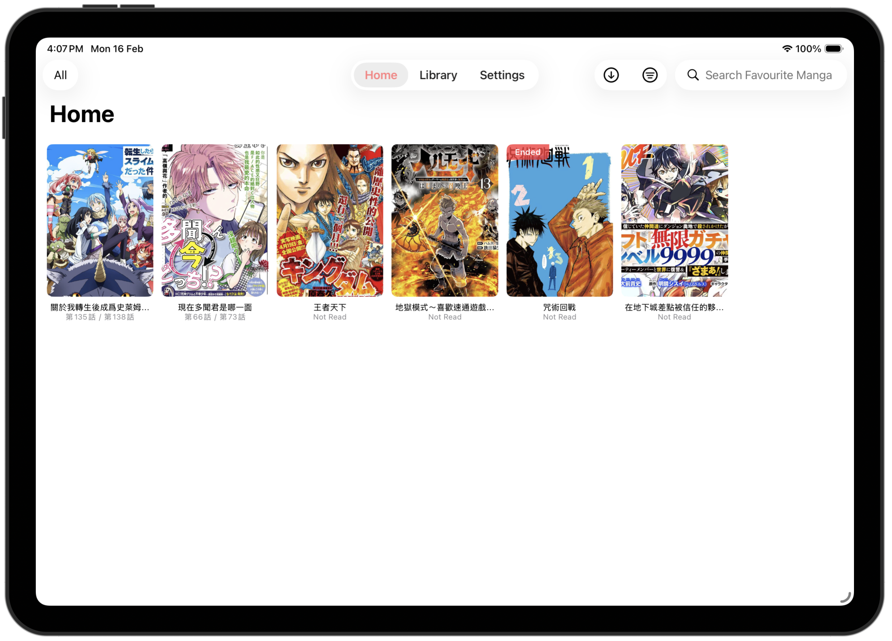

<details>
<summary>More Screenshots</summary>

### iPhone

|              Home               |                Library                |                Details                |
| :-----------------------------: | :-----------------------------------: | :-----------------------------------: |
| 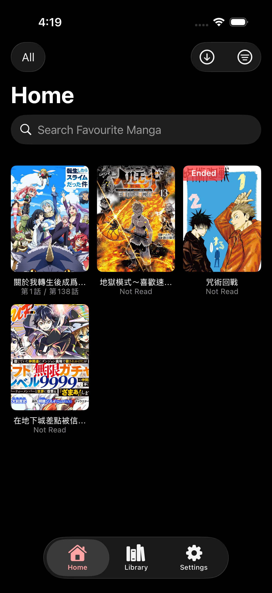 | 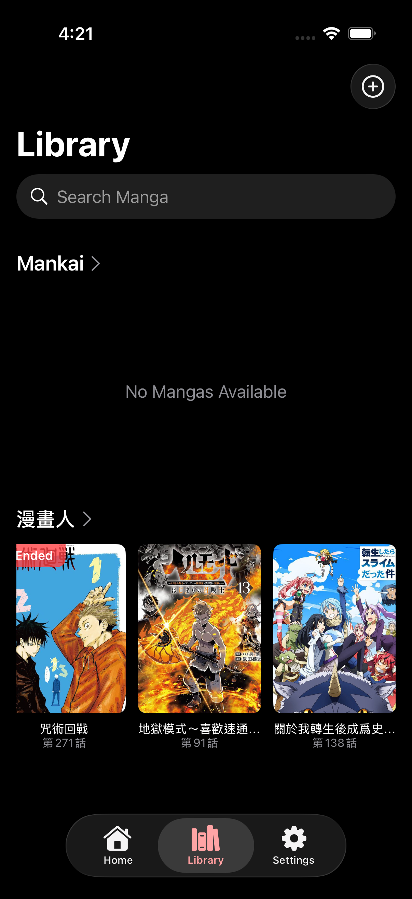 | 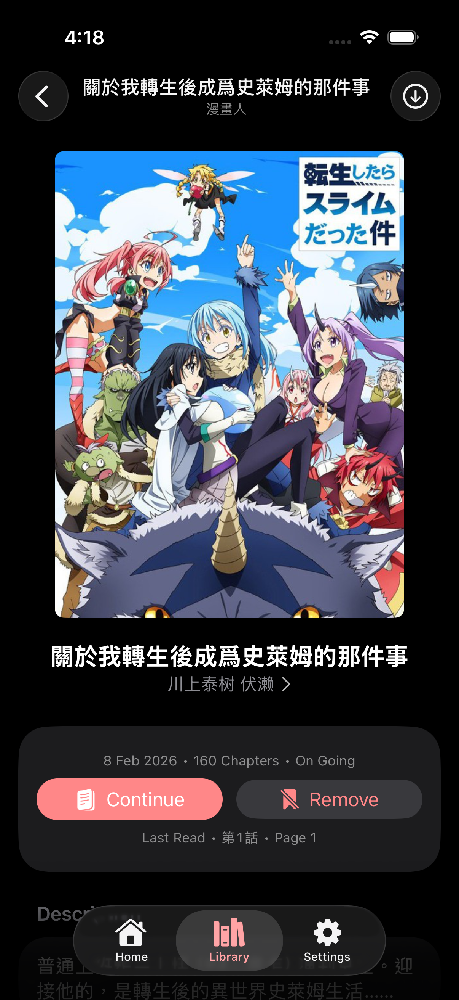 |

|                History                |                 Downloads                 |               Reader                |
| :-----------------------------------: | :---------------------------------------: | :---------------------------------: |
| 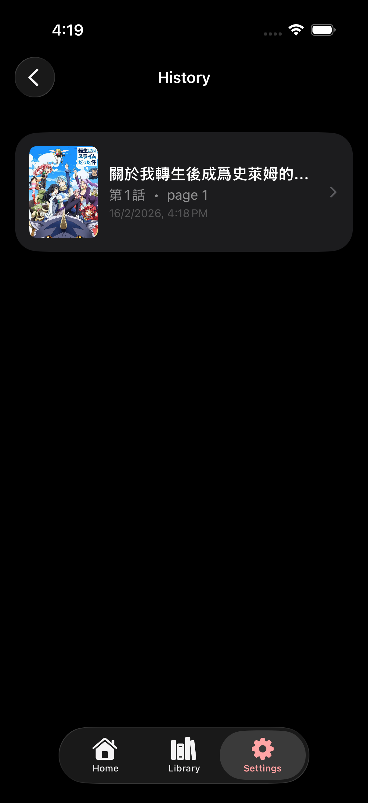 | 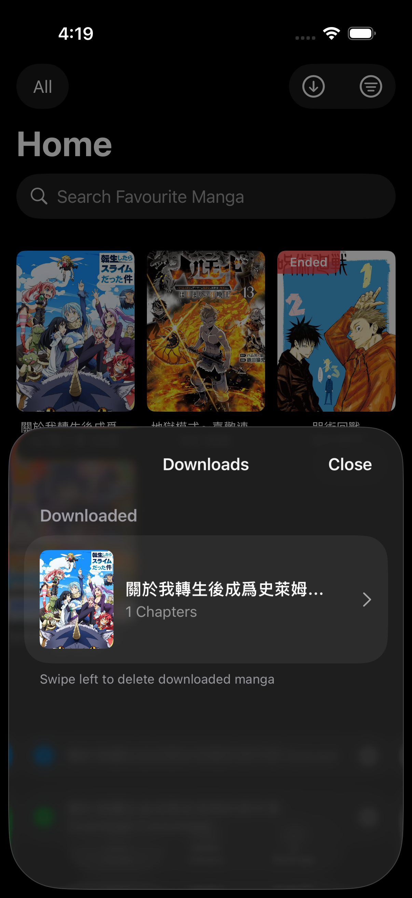 | 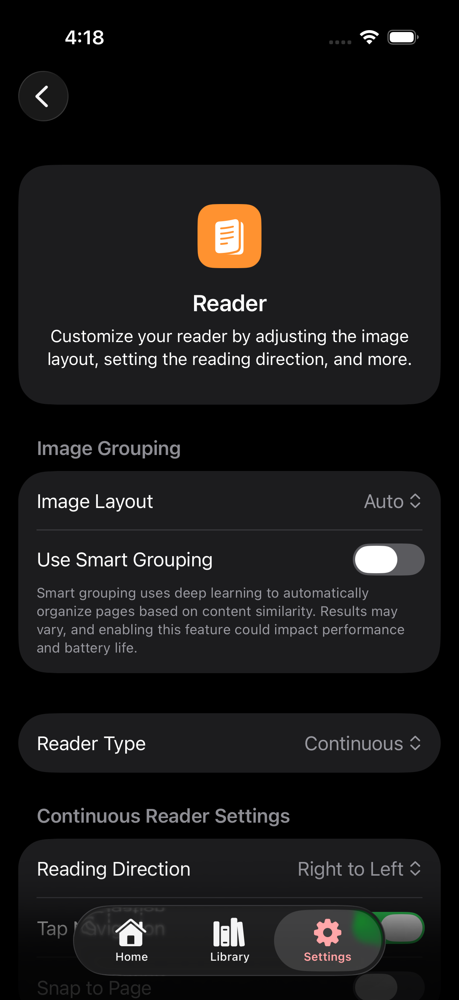 |

### iPad

|             Home              |               Library               |               Details               |
| :---------------------------: | :---------------------------------: | :---------------------------------: |
| 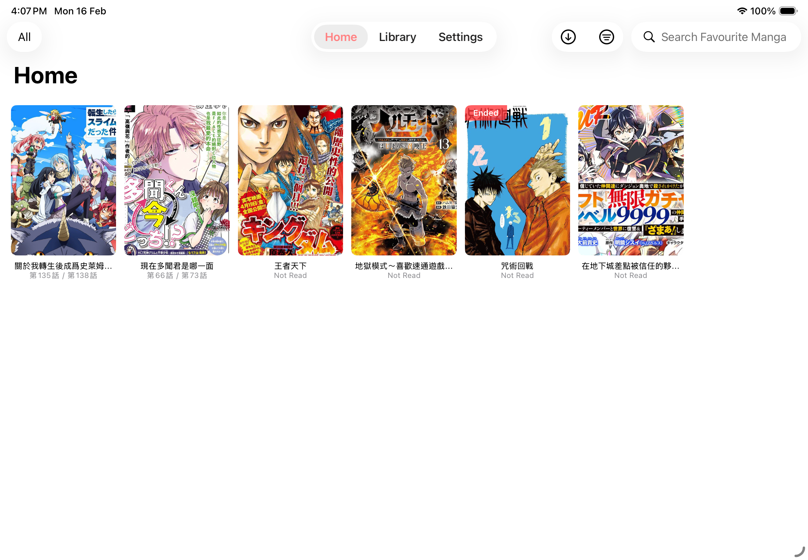 | 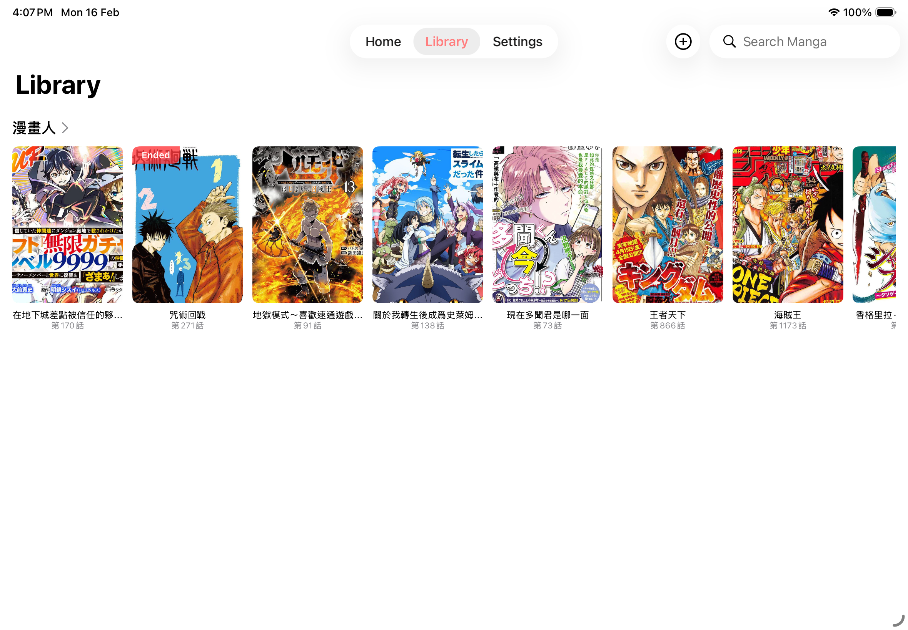 | 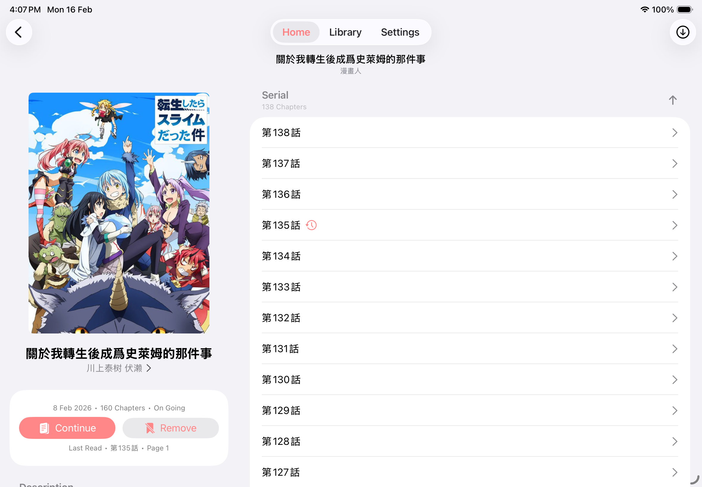 |

|               History               |                Downloads                |              Reader               |
| :---------------------------------: | :-------------------------------------: | :-------------------------------: |
| 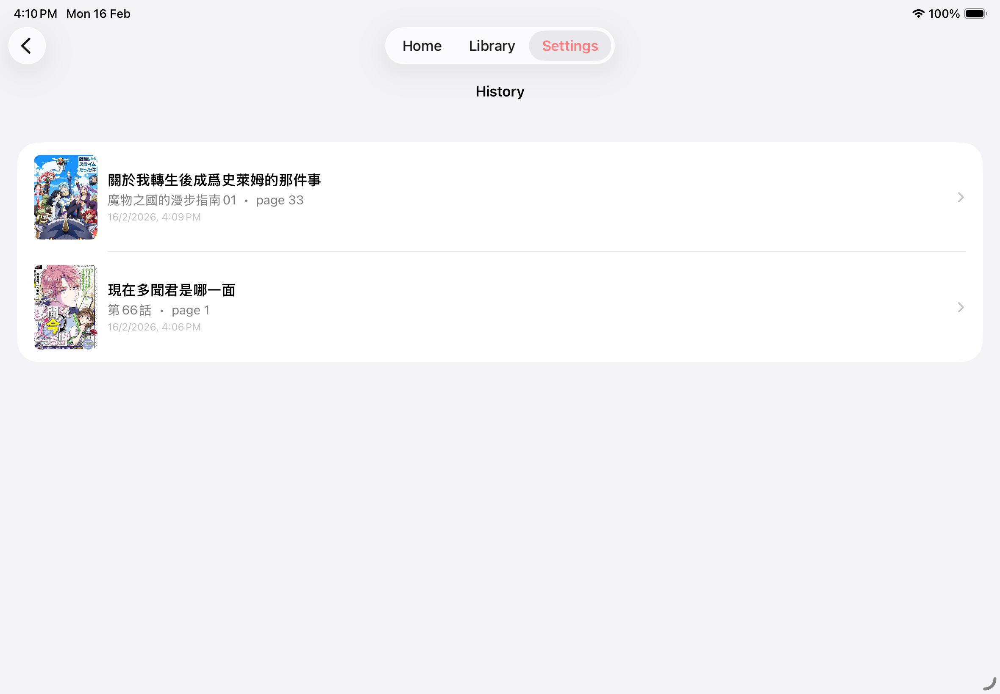 | 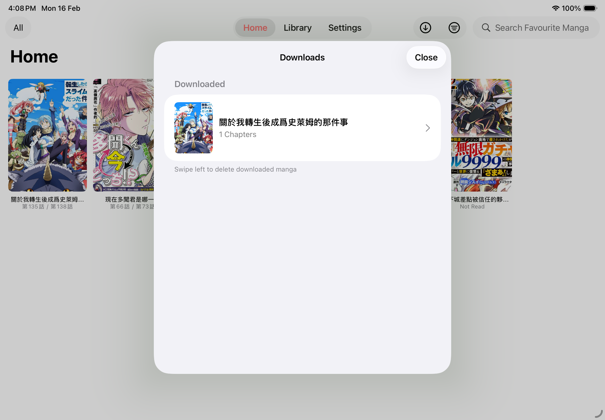 | 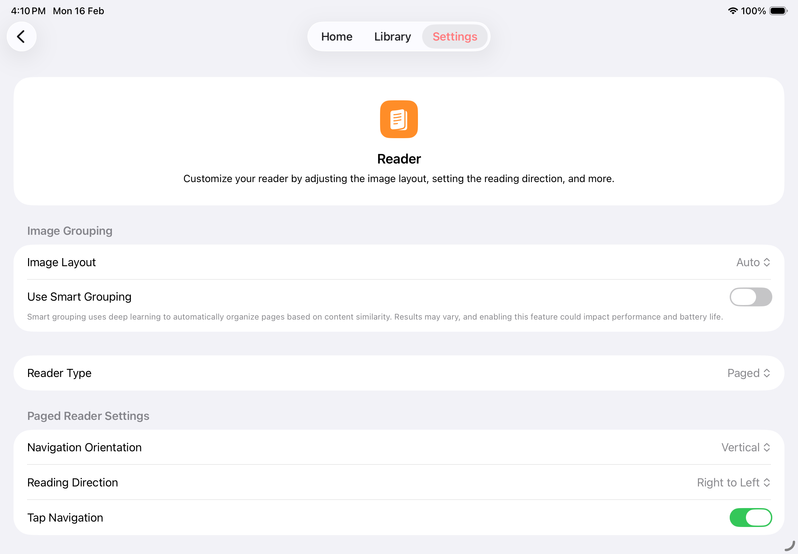 |

</details>

## Features

- **Extensible Plugin System**: Support for [JavaScript, File System, and HTTP](#plugins) sources.
- **Local Collections**: Read [CBZ and CBR files](#parsers) and manage local collections stored on your device.
- **Modern UI**: A responsive interface built with SwiftUI.
- **High-Performance Readers**: [Continuous and Paged](#reader) reading modes built on UIKit.
- **Smart Grouping**: Deep learning-powered [automatic spread detection](#smart-grouping).
- **Library & History**: Manage your collection and track reading progress.
- **Cross-Device Syncing**: Keep your library in sync using [HttpEngine or Supabase](#syncing).
- **Download Manager**: Save manga chapters for offline access.

## Plugins

Mankai is designed to be extensible. It supports three types of plugins, each serving a distinct function:

### JavaScript Plugin (JsPlugin)

This plugin scrapes content from third-party manga websites, allowing you to browse and read manga from various online aggregators directly within the app.

- **Plugins Examples**: [mankai-plugins](https://github.com/nohackjustnoobb/mankai-plugins)

### File System Plugin (FsPlugin)

This plugin manages manga stored as local files stored on your device or a connected service.

### Http Plugin (HttpPlugin)

This plugin is designed for external providers to use Mankai as a reader and, optionally, an editor. It connects to servers implementing the standard API and supports authentication.

- **Specification**: [Mankai API Specification](docs/httpplugin/api.md) (see also the [Mankai Editor API Specification](docs/httpplugin/editor-api.md) for optional editor support)
- **Server**: [mankai-server](https://github.com/nohackjustnoobb/mankai-server) - a manga management and sync server implementing the API.

## Reader

Mankai provides two high-performance reading modes, both implemented in UIKit to ensure smooth scrolling and page transitions:

- **Continuous Reader**: A traditional webtoon-style vertical scrolling experience.
- **Paged Reader**: A paginated experience supporting both vertical and horizontal reading directions.

### Smart Grouping

Mankai features an advanced **Smart Grouping** system that uses a deep learning model to detect and merge split-page spreads. By analyzing the visual adjacency of images, the app can automatically group two separate files into a single seamless spread, restoring the original artistic intent.

- **Model Repository**: [mankai-smart-grouping](https://github.com/nohackjustnoobb/mankai-smart-grouping)

#### Performance

| Metric            | Value                   |
| :---------------- | :---------------------- |
| **Base Model**    | `mobilenetv3_large_100` |
| **Test Accuracy** | 99.88%                  |
| **Precision**     | 99.90%                  |
| **Recall**        | 99.86%                  |
| **F1 Score**      | 99.88%                  |

#### Inference

Performance benchmarks on **iPhone 15**:

| Compute Units           | Prediction (Median) | Load (Median) | Compilation (Median) |
| :---------------------- | :------------------ | :------------ | :------------------- |
| **All**                 | 0.94 ms             | 21.77 ms      | 65.11 ms             |
| **CPU Only**            | 2.28 ms             | 17.94 ms      | 62.82 ms             |
| **CPU + GPU**           | 8.15 ms             | 21.09 ms      | 81.25 ms             |
| **CPU + Neural Engine** | 0.91 ms             | 45.80 ms      | 64.19 ms             |

## Syncing

Mankai supports syncing your library and reading history across devices using the following sync engines:

### HttpEngine

The **HttpEngine** requires a self-hosted server to function. You can use either of the following:

- **[mankai-server](https://github.com/nohackjustnoobb/mankai-server)** - A manga management and sync server, which can also serve as an [HttpPlugin](#http-plugin-httpplugin) source.
- **[mankai-sync](https://github.com/nohackjustnoobb/mankai-sync)** - A lightweight server dedicated solely to syncing.

Once hosted, you can configure the server URL in the app settings to enable syncing.

### SupabaseEngine

The **SupabaseEngine** allows you to sync using Supabase as the backend. You can set up your own Supabase project using the database schema provided in the [mankai-supabase](https://github.com/nohackjustnoobb/mankai-supabase) repository.

Once configured, you can enter your Supabase URL and Key in the app settings to enable syncing.

## Parsers

Mankai ships with built-in parsers that read local book files (e.g., CBZ and CBR) and extract their metadata and images. Each parser targets a specific file format.

| Parser        | Extensions | Description                                                                                                  |
| :------------ | :--------- | :----------------------------------------------------------------------------------------------------------- |
| **CbzParser** | `.cbz`     | Parses Comic Book ZIP archives, extracting metadata from `ComicInfo.xml` and images from the archive.        |
| **CbrParser** | `.cbr`     | Parses Comic Book RAR archives, extracting metadata from `ComicInfo.xml` and images from the archive.        |

## Development Notes

**Automatic Build Numbers**

The repository includes a pre-commit hook that increments Xcode's `CURRENT_PROJECT_VERSION` once per commit and keeps the app and thumbnail extension build numbers synchronized.

Enable the version-controlled hooks once after cloning:

```sh
git config core.hooksPath .githooks
```

The hook stages the updated Xcode project file automatically. If that file has unstaged changes, the commit stops so unrelated Xcode settings are not staged silently, stage or stash those changes and retry the commit. A failed or retried commit reuses the same build number.

**Performance with Debugger Attached (e.g., from Xcode):**

- The startup time will be significantly slower than normal.
- The app may temporarily freeze on the first scroll in the reader screen.

These issues do not occur when running the app without a debugger attached.

## Road to 1.0.0

### Sync Engines

- [ ] **iCloud** - Pending availability of resources (aka. I have no money)

### Network Protocols

- [ ] **SMB** - Server Message Block support.
- [ ] **WebDAV** - Web Distributed Authoring and Versioning support.
- [ ] **NFS** - Network File System support.
- [ ] **FTP** - File Transfer Protocol support.
- [ ] **SFTP** - SSH File Transfer Protocol support.

### Parsers

- [ ] **EPUB** - Digital book format.
- [ ] **PDF** - Portable Document Format.
- [x] **CBR** - Comic Book RAR archive.
- [ ] **Mankai Custom Format** - A dedicated format tailored to Mankai's needs.

### AI Features

- [ ] **AI Upscaling** - Enhance low-resolution pages for a sharper reading experience.
